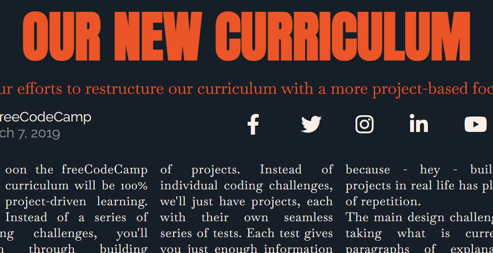

# building-a-magazine

A webpage that demos a magazine format.

**Live-Demo:** [https://oendemann.github.io/building-a-magazine/]

---

---

## About The Page

A freeCodeCamp project that demos a physical magazine format. This project has a focus on CSS grid, including concepts like grid rows and columns and specifics on how to format said grid.

---

## Built With

* **HTML:** Primarily used to organize the magazine into different clases for later CSS design (e.g. hero, author, etc). Also used to add all text, image, and icon content.
* **CSS:** Used to format the webpage using CSS grid, and the overall design of the page (color, font-size, etc).

---

## What I Learned

1. Attributes (like width for images) for elements can be set in html. 
2. CSS grid and its associated attributes (like grid-template-columns, grid-auto-flow, etc) is another tool for formatting webpages.

## Acknowledgments

* Project idea and requirements from [freeCodeCamp.org](https://www.freecodecamp.org/)